##  [《图解 Kafka 之实战指南》](https://s.juejin.cn/ds/YsX42xu/) ，点击查看原书

### chapter_12 指定位移消费

在 Kafka 中每当消费者查找不到记录的消费位移时，就会根据消费者客户端参数 **auto.offset.reset** 的配置来决定从何处开始进行消费，
这个参数的默认值为`latest`，表示从分区末尾开始消费消息，如下图所示，默认从9开始拉取消息进行消费，如果配置成`earliest`，那么从0开始消费

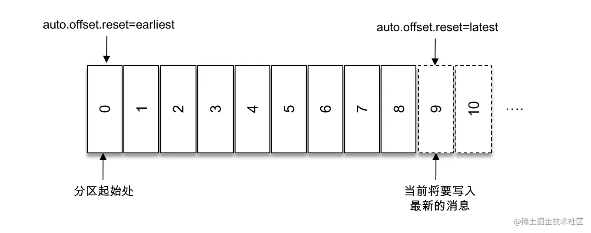

相反，如果能找到对应的消费位移，那么这个配置就没啥用。或者当我们指定的消费位移超出了该分区的位移范围，这个参数也会生效。

我们可以使用`seek方法`来对指定分分区具体的位移处的消息进行消费。

`Map<TopicPartition, Long> endOffsets(Collection<TopicPartition> partitions)` 获取到的位置不是上图中的8而是9

`Map<TopicPartition, Long> beginningOffsets(Collection<TopicPartition> partitions)` 获取消息开始的位置

通过如上两个方法，可以根据获取到的每个分区的偏移量来选择从分区头还是从分区尾进行消费，或者更直接的选择`seekToBeginning`和`seekToEnd`方法。

---

当然还有一种更加符合业务逻辑的指定位移消费的方式

`Map<TopicPartition, OffsetAndTimestamp> offsetsForTimes(Map<TopicPartition, Long> timestampsToSearch)`

可以通过这个方法来获取到指定分区的对应时间戳的消费位移，获取到消费位移后，再调用seek方法，便可以消费具体时间的处的消费位移的消息了

到这里我们可以知道，只要有了消费位移那么我们就可以`随意`消费消息，如果我们把对应的消费位移保存到数据库或者缓存中，那么灵活性和可用性就高的多了！

### chapter_11

消费者消费完消息后，会对消费位移进行提交。如下图，消费完x位置的消息后，提交的位移为x + 1，而不是x。

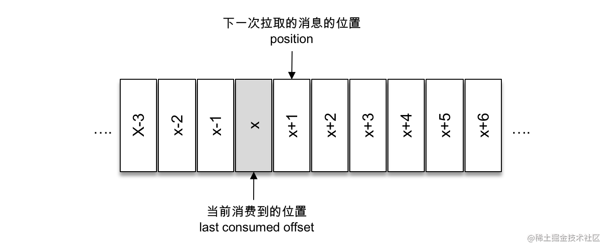

提交后的位移参数会在Kafka内部主题`__consumer_offsets`中记录，供之后拉取消息时判断，避免拉到重复的消息。而且如果当有新的消费者加入时，
如果没有持久化消费位移，那么这个新的消费者也没办法知道该从哪里进行消费。

如果我们定义x为`consumedOffset`，那么提交位移为`committedOffset`，还有一个位移值得注意，那就是调用position方法获取的`拉取下一条消费的位移`
`nextMessageOffset`，它在我们的例子中和committed是相等的。

Kafka默认的位移提交方式是自动提交，由`enable.auto.commit`配置，提交的周期是由`auto.commit.interval.ms`配置，默认周期是5秒，
也就是说它会每隔5秒拉取到每个分区中最大的消息位移，但是它的提交动作是在poll()方法逻辑里，在每次向服务端拉取请求之前会检查是否可以进行位移提交。

虽然自动提交消费位移的方式非常便捷，但是它可能带来**重复消费**和**消息丢失**的问题。

- 重复消费：假设刚刚提交完一次消费位移，拉取到一批消息进行消费，在下一次消费位移提交前，消费者客户端宕机， 
  那么又需要从上一次位移提交的地方重新开始消费。虽然我们可以通过缩小提交的周期来减小重复消息的窗口，但是这样并不能避免重复消费，
  而且使得位移提交更加频繁。

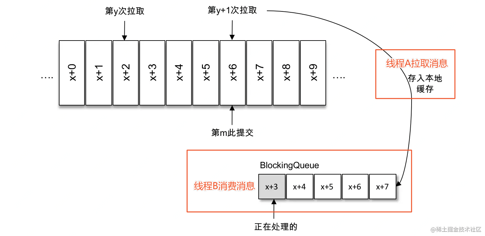

- 消息丢失：如上图线程A负责拉取消息存入本地缓存BlockingQueue，线程B则负责从缓存中对消息进行消费，假设现在进行到了y + 1次拉取，第m次提交，
也就是x + 6之前的消息已经确认提交了，但是目前线程B消费的比较慢，还在x + 3，如果此时该线程出现异常，恢复后就需要从x + 6处开始消费了，
  丢失了x + 3到x + 5的消息。
  
**自动提交认为拉取到消息就是消费成功**，而**手动提交可以位移提交精细化**，这样就可以做到在写入数据库或执行完业务逻辑后再提交消费位移。

我们需要更改配置`enable.auto.commit`为false，并且KafkaConsumer提供了同步和异步提交的方法。

但是在消费者客户端在同步提交位移之前出现崩溃，还是会出现重复消费的现象，不过这种重复消费的问题比较难避免。

### chapter_10
消息的消费一般有两种模式：推模式和拉模式。Kafka 中的消费是基于拉模式的，调用poll方法可以指定拉消息的超时时间(Duration)。

对poll过来的多条消息可以调用records方法根据特定的话题或分区来选择性消费。

### chapter_09
反序列化器，Spring框架里有一个现成的Json的序列/反序列化器还挺好的

### chapter_08

消费者订阅支持指定主题名订阅，也支持正则表达式订阅，后者相对更灵活一些。

消费者通过assign方法可以订阅某个主题具体分区的消息，那不知道这个主题有那个分区咋办？
可以通过`partitionsFor`方法看看

不想听这个主题的消息了就换台，用unsubscribe方法取消订阅

通过 `subscribe()` 方法订阅主题具有消费者自动再均衡的功能，在多个消费者的情况下可以根据分区分配策略来自动分配各个消费者与分区的关系。
当消费组内的消费者增加或减少时，分区分配关系会自动调整，以实现消费负载均衡及故障自动转移。
而通过 `assign()` 方法订阅分区时，是不具备消费者自动均衡的功能的

### chapter_07

每个消费者都有一个对应的消费组，当消息发布到主题后，**它只会被投递给订阅它的每个消费组中的一个消费者**。

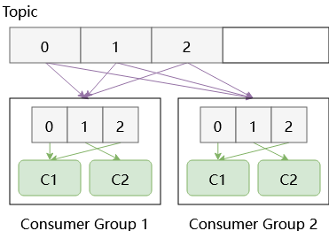

如上图所示，两个消费组都订阅了Topic的三个分区，那么所有消息都会重复发送给两个消费组，但是在每个消费组内，每条消息只由一个消费者来消费。

Kafka支持点对点/发布订阅两种消费模式，消费组对主题的订阅属于发布订阅模式，而在消费组内消费是点对点模式，每条消息只会被一个消费者消费。

消费组的名称可以通过`group.id`来配置

### chapter_06

- 重要的生产者参数

1. **acks** 这个参数指定分区中必须要有多少个副本收到这条消息，生产者才认为这条消息是成功写入的。

**默认值为1**，即生产者发送消息后，只要分区leader副本成功写入消息，那么它就会收到来自服务器的成功响应。如果消息写入leader副本成功，但是在被follower
   副本拉取之前leader崩溃，那么这条消息还是会丢失。它是消息可靠性和吞吐量之间的折中方案。
   
**当acks = 0时**，生产者发送消息之后不需要等待任何服务器的响应就认定发送成功。这是吞吐量最大的方案。

**当acks = -1或acks = all时**，生产者发送消息之后，需要等待ISR中所有副本写入才能收到来自服务器的成功响应。它是可靠性最高的方案，
但是也并不意味着消息就一定可靠，因为如果ISR中只有leader一个那么它其实和配置ack = 1的效果是一样的。
   
2. **max.request.size**: 这个参数用来限制生产者客户端能发送消息的最大值，默认为1048576B，即1MB。这个参数会涉及与 **message.max.bytes**
参数的联动，如果将 message.max.bytes配置为10而max.request.size配置为20，这时候发送一条15b的消息，就会出现异常。
   
> org.apache.kafka.common.errors.RecordTooLargeException: The request included a message larger than the max message size the server will accept.

3. **max.in.flight.requests.per.connection**: 限制每个连接（也就是客户端与 Node 之间的连接）最多缓存的请求数，在需要保证消息顺序的场景下
建议把这个参数配置为1，如果这个参数大于1且失败重试次数非零时，会出现错序的现象：第一批次写入失败，第二批次写入成功，第一批次重试写入成功后则会发生错序。
   
4. **retries和retry.backoff.ms**: 前者用来配置生产者发送消息失败后重试的次数，后者用来配置两次重试间的时间间隔，尽可能避免无效重试，也可以估算
一下异常恢复的时间，合理配置时间间隔来避免生产者过早的放弃重试。像网络波动和leader副本选举发生时，通过重试是能将消息发送成功的。
   
5. **compression.type**: 这个参数用来指定消息的压缩方式，默认值为“none”，即默认情况下，消息不会被压缩。
   该参数还可以配置为“gzip”“snappy”和“lz4”。对消息进行压缩可以极大地减少网络传输量、降低网络I/O，从而提高整体的性能。
   消息压缩是一种使用时间换空间的优化方式，如果对时延有一定的要求，则不推荐对消息进行压缩。
   
6. **connections.max.idle.ms**: 这个参数用来指定在多久之后关闭闲置的连接，默认值是540000（ms），即9分钟。

7. linger.ms: 这个参数用来指定生产者发送 ProducerBatch 之前等待更多消息（ProducerRecord）加入 ProducerBatch 的时间，默认值为0。 
生产者客户端会在 ProducerBatch 被填满或等待时间超过 linger.ms 值时发送出去。增大这个参数的值会增加消息的延迟，但是同时能提升一定的吞吐量。

8. receive.buffer.bytes: 这个参数用来设置 Socket 接收消息缓冲区（SO_RECBUF）的大小，默认值为32768（B），即32KB。
如果设置为-1，则使用操作系统的默认值。如果 Producer 与 Kafka 处于不同的机房，则可以适地调大这个参数值。

9. send.buffer.bytes: 这个参数用来设置 Socket 发送消息缓冲区（SO_SNDBUF）的大小，默认值为131072（B），即128KB。
与 receive.buffer.bytes 参数一样，如果设置为-1，则使用操作系统的默认值。

10. request.timeout.ms: 这个参数用来配置 Producer 等待请求响应的最长时间，默认值为30000（ms）。请求超时之后可以选择进行重试。
注意这个参数需要比 broker 端参数 replica.lag.time.max.ms 的值要大，这样可以减少因客户端重试而引起的消息重复的概率。

11. enable.idempotence: 是否开启幂等性功能

### chapter_05

- 生产者客户端的整体架构

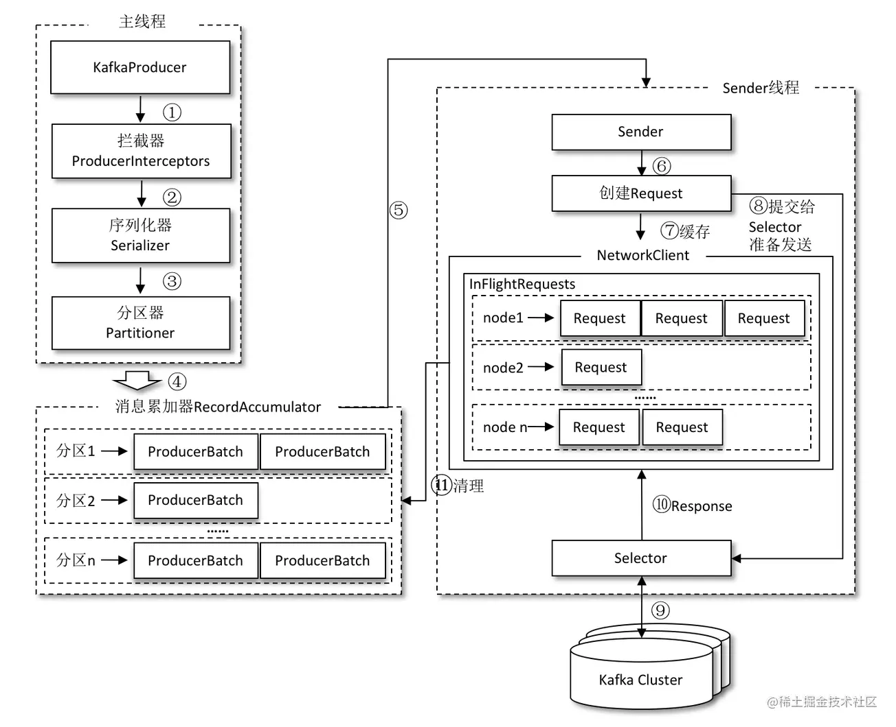

整个生产者客户端由两个线程协调运行，这两个线程分别为主线程和 Sender 线程（发送线程）。在主线程中由 KafkaProducer 创建消息，
然后通过可能的拦截器、序列化器和分区器的作用之后缓存到消息累加器（RecordAccumulator，也称为消息收集器）中。

Sender 线程负责从 RecordAccumulator 中获取消息并将其发送到 Kafka 中。RecordAccumulator 缓存的大小可以通过生产者客户端参数 buffer.memory 配置，默认值为 33554432B，即32MB。

RecordAccumulator 主要用来缓存消息以便 Sender 线程可以批量发送，进而减少网络传输的资源消耗以提升性能。

如果生产者发送消息的速度超过发送到服务器的速度，则会导致生产者空间不足，这个时候 KafkaProducer 的 send() 方法调用要么被阻塞，
要么抛出异常，这个取决于参数 max.block.ms 的配置，此参数的默认值为60000，即60秒。

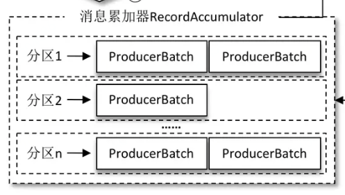

在 RecordAccumulator 的内部为每个分区都维护了一个双端队列，队列中的内容是ProducerBatch，消息写入缓存时，追加到双端队列的尾部；Sender 读取消息时，从双端队列的头部读取。

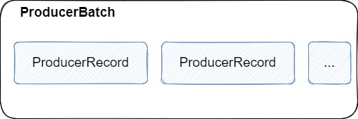

ProducerBatch 中可以包含一至多个 ProducerRecord，
ProducerRecord 是生产者中创建的消息，而 ProducerBatch 是指一个消息批次，ProducerRecord 会被包含在 ProducerBatch 中，
这样可以使字节的使用更加紧凑。与此同时，将较小的 ProducerRecord 拼凑成一个较大的 ProducerBatch，也可以减少网络请求的次数以提升整体的吞吐量。

消息在网络上都是以字节（Byte）的形式传输的，在发送之前需要创建一块内存区域来保存对应的消息。这一点我们在定义序列化器和反序列化器时可以发现。

在 Kafka 生产者客户端中，通过 ByteBuffer 实现消息内存的创建和释放。 不过频繁的创建和释放是比较耗费资源的，
在 RecordAccumulator 的内部还有一个 BufferPool，它主要用来实现 ByteBuffer 的复用，以实现缓存的高效利用。

不过 BufferPool 只针对特定大小的 ByteBuffer 进行管理，而其他大小的 ByteBuffer 不会缓存进 BufferPool 中，
这个特定的大小由 batch.size 参数来指定，默认值为16384B，即16KB。我们可以适当地调大 batch.size 参数以便多缓存一些消息。

当一条消息（ProducerRecord）流入 RecordAccumulator 时，会先寻找与消息分区所对应的双端队列（如果没有则新建），
再从这个双端队列的尾部获取一个 ProducerBatch（如果没有则新建），查看 ProducerBatch 中是否还可以写入这个 ProducerRecord，如果可以则写入，
如果不可以则需要创建一个新的 ProducerBatch。在新建 ProducerBatch 时评估这条消息的大小是否超过 batch.size 参数的大小，
如果不超过，那么就以 batch.size 参数的大小来创建 ProducerBatch，这样在使用完这段内存区域之后，可以通过 BufferPool 的管理来进行复用；
如果超过，那么就以评估的大小来创建 ProducerBatch，这段内存区域不会被复用。

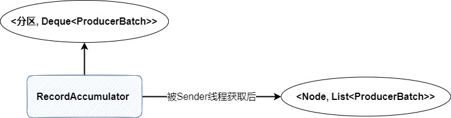

Sender 从 RecordAccumulator 中获取缓存的消息之后，会进行如上图所示的数据类型转换，由先前的`<分区, Deque<ProducerBatch>>`类型转换成
`<Node, List< ProducerBatch>>`类型，其中Node为broker节点，相当于是做了从应用层到网络I/O层的转换，因为对于网络链接来说，它只关系需要
发送的目的broker节点，并不关心应用层消息所在的分区。

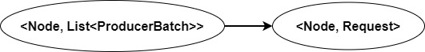

Sender之后还会对他进行一次封装，封装成<Node, Request>的形式，这样就更直观的展示了将Request发往各个Node的逻辑。

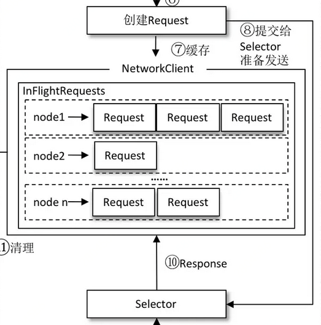

请求在从 Sender 线程发往 Kafka 之前还会保存到 InFlightRequests 中，InFlightRequests 保存对象的具体形式为 `Map<NodeId, Deque<InFlightRequest>>`，
它的主要作用是缓存了已经发出去但还没有收到响应的请求（NodeId 是一个 String 类型，表示节点的 id 编号）

对应的InFlightRequests注释
> The set of requests which have been sent or are being sent but haven't yet received a response

通过配置max.in.flight.requests. per. connection，默认为5，可以配置最多缓存的请求数。如果超过了这个数量，就不能再向这个连接发送更多的请求了。

---
- 元数据的更新

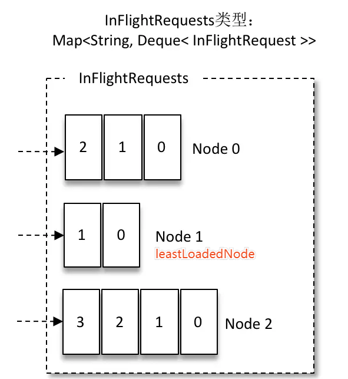

在`InFlightRequests`中还能获取到`leastLoadedNode`，即未确认请求数最少的Node。那么选择该Node发送请求则可以尽快发出，这个特性可以应用在元数据请求时。

为什么要更新元数据？

比如我们要发送这条消息，但是这条消息除了知道主题以外，其他信息一概不知。
```java
ProducerRecord<String, String> record = new ProducerRecord<>(topic, "Hello, Kafka!");
```
而实际上KafkaProducer需要将这条消息追加到**指定主题的所在的某个分区的leader副本**之下，因此我们就需要获取到 **“足够多的元数据信息”** 来达到这一点。

元数据都包含了啥呢？集群中用哪些节点、有哪些主题，这些主题有哪些分区，
每个分区的leader副本在哪个broker节点上，follower副本在哪些节点上，哪些副本在AR、ISR等集合中...

那该如何获取这些元数据呢？

我们在bootstrap.servers 参数上配置了broker节点地址，Sender线程会挑选出`leastLoadedNode`发送向其获取元数据的请求，这个过程是在客户端内部进行的，
对使用者不可见，请求完成后便会获取到需要的元数据信息。超过 `metadata.max.age.ms` 时间没有更新元数据都会引起元数据的更新操作，默认为5分钟

### chapter_04
消息在通过 send() 方法发往 broker 的过程中，有可能需要经过拦截器（Interceptor）、序列化器（Serializer）和
分区器（Partitioner）的一系列作用之后才能被真正地发往 broker。

- 序列化器和反序列化器: 生产者需要用序列化器（Serializer）把对象转换成字节数组才能通过网络发送给 Kafka。
而在对侧，消费者需要用反序列化器（Deserializer）把从 Kafka 中收到的字节数组转换成相应的对象

- 分区器: 消息经过序列化之后就需要确定它发往的分区，如果消息 ProducerRecord 中指定了 partition 字段，那么就不需要分区器的作用(自己写了一个简单分区器)

- 生产者拦截器: 注意看一下MyProducerInterceptor的方法注释

### chapter_03

配置信息以KafkaConfig类中注释为准，包括key, value的序列化和反序列化; 集群地址; 客户端ID; 消息发送阻塞时间和重试次数

Kafka消息对象
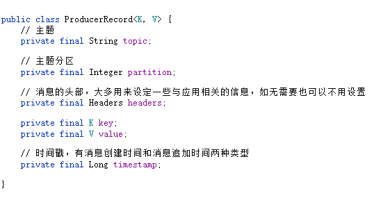

分别写了同步发送和异步发送消息的方法，其中同步是采用Future的get阻塞调用，异步是添加了回调方法处理的

注意close()方法是在阻塞等待之前所有的发送请求完成后再关闭

### chapter_02

在远程Linux上配置
```xml
listeners=PLAINTEXT://内网IP:9092

advertised.listeners=PLAINTEXT://外网IP:9092
```

创建分区为4副本因子为3的话题
```
bin/kafka-topics.sh --zookeeper localhost:2181 --create --topic topic-demo --replication-factor 3 --partitions 4
```

展示主题的更多具体信息
```
bin/kafka-topics.sh --zookeeper localhost:2181 --describe --topic topic-demo
```

通过 kafka-console-consumer.sh 脚本来订阅主题 topic-demo 其中--bootstrap-server 指定了连接的 Kafka 集群地址
```
bin/kafka-console-consumer.sh --bootstrap-server 10.0.24.15:9092 --topic topic-demo
```

使用 kafka-console-producer.sh 脚本发送一条消息“Hello, Kafka!”至主题 topic-demo
```
bin/kafka-console-producer.sh --broker-list 10.0.24.15:9092 --topic topic-demo
> hello Kafka!
```

--- 
配置文件中的参数

- zookeeper.connect: 该参数指明 broker 要连接的 ZooKeeper 集群的服务地址（包含端口号），没有默认值，且此参数为必填项
- listeners: 该参数指明 broker 监听客户端连接的地址列表，即为客户端要连接 broker 的入口地址列表，
  protocol1://hostname1:port1,protocol2://hostname2:port2(协议://主机名:port，多个以逗号隔开)
- advertised.listeners: 公有云上的机器通常配备有多块网卡，即包含私网网卡和公网网卡，对于这种情况而言，
  可以设置 advertised.listeners 参数绑定公网IP供外部客户端使用，而配置 listeners 参数来绑定私网IP地址供 broker 间通信使用。
- broker.id: 指定 Kafka 集群中 broker 的唯一标识
- log.dir和log.dirs: Kafka 把所有的消息都保存在磁盘上，而这两个参数用来配置 Kafka 日志文件存放的根目录。一般情况下，log.dir 用来配置单个根目录，
  而 log.dirs 用来配置多个根目录（以逗号分隔），但是 Kafka 并没有对此做强制性限制，也就是说，log.dir 和 log.dirs 都可以用来配置单个或多个根目录。
  log.dirs 的优先级比 log.dir 高，但是如果没有配置 log.dirs，则会以 log.dir 配置为准。默认情况下只配置了 log.dir 参数，其默认值为 /tmp/kafka-logs。
- message.max.bytes: 该参数用来指定 broker 所能接收消息的最大值，默认值为1000012（B），约等于976.6KB。
  如果 Producer 发送的消息大于这个参数所设置的值，那么（Producer）就会报出 RecordTooLargeException 的异常。
  如果需要修改这个参数，那么还要考虑 max.request.size（客户端参数）、max.message.bytes（topic端参数）等参数的影响。
  为了避免修改此参数而引起级联的影响，建议在修改此参数之前考虑分拆消息的可行性。

### chapter_01

Kafka的三大角色

- **消息系统**： Kafka 和传统的消息系统（也称作消息中间件）都具备系统解耦、冗余存储、流量削峰、缓冲、异步通信、扩展性、可恢复性等功能。与此同时，
  Kafka 还提供了大多数消息系统难以实现的**消息顺序性保障**及**回溯消费**的功能。
  
- **存储系统**： Kafka 把消息持久化到磁盘，相比于其他基于内存存储的系统而言，有效地降低了数据丢失的风险。
  也正是得益于 Kafka 的消息持久化功能和多副本机制， 我们可以把 Kafka 作为长期的数据存储系统来使用，
  只需要把对应的数据保留策略设置为“永久”或启用主题的日志压缩功能即可。
  
- **流式处理平台**： Kafka 不仅为每个流行的流式处理框架提供了可靠的数据来源，还提供了一个完整的流式处理类库，比如窗口、连接、变换和聚合等各类操作。


1. kafka集群包含一个或多个服务器，而每个服务器可以简单的被称为broker，生产者producer和消费者consumer是broker的客户端。
   一个典型的Kafka体系包含若干producer、若干broker和若干consumer，producer发送消息到broker，consumer拉取消息进行消费，如下图所示


2. kafka中有主题和分区的概念。Kafka中的消息是以主题为单位进行归类的，生产者负责将消息发送到具体的主题，消费者负责订阅主题并进行消费。
   每一个主题可以分为多个分区（也可以称为是主题分区），分区其实在存储层面对应的是一个log文件，文件中会记录偏移量（offset）来保证消息在分区内的顺序。
   如下图所示，一个主题有三个分区，消息会被追加到每个分区的log文件的尾部。每一条消息被发送到broker之前，会根据分区规则存储到具体的分区，
   如果主题只有一个分区的话，那么这个文件在服务器上的log文件I/O将成为性能的瓶颈，合理指定分区数则能解决这个问题。

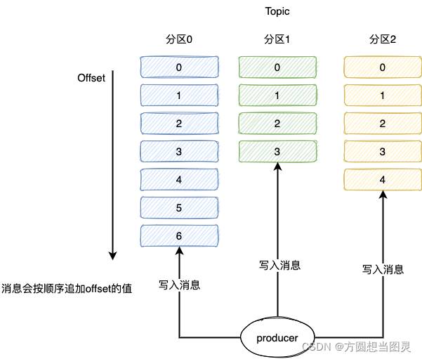

3. 分区可以分布在不同的broker上，也就是说，一个主题的多个分区可以横跨多个broker。同时kafka的分区具有多副本机制，通过增加副本的数量来增加容灾能力。
   同一个分区的不同副本中保存的是相同的消息（follower副本完成消息同步之后），副本与副本之间是一主多从的关系，其中只有leader副本负责读写，
   而follower副本只负责从leader副本处进行消息同步。如下图所示，一个主题有三个分区，副本因子也为三（即每个分区的副本个数为三，
   那么每个分区就有一个leader副本和两个follower副本），均匀的分布在三个broker上。

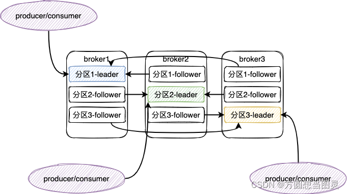

4. 当leader副本出现故障时，会从follower中选举出新的leader副本来对外提供服务。分区中的所有副本统称为AR，
   所有与leader副本保持同步的副本被称为ISR，与leader副本同步滞后的被称为OSR。
   
5. 消息会先发送到 leader 副本，然后 follower 副本才能从 leader 副本中拉取消息进行同步，
   同步期间内 follower 副本相对于 leader 副本而言会有一定程度的滞后。滞后范围可以通过参数进行配置。
   leader 副本负责维护和跟踪 ISR 集合中所有 follower 副本的滞后状态，当 follower 副本落后太多或失效时，leader 副本会把它从 ISR 集合中剔除，
   被移动到OSR集合。如果 OSR 集合中有 follower 副本“追上”了 leader 副本，那么 leader 副本会把它从 OSR 集合转移至 ISR 集合。
   默认情况下，当 leader 副本发生故障时，只有在 ISR 集合中的副本才有资格被选举为新的 leader，
   而在 OSR 集合中的副本则没有任何机会（不过这个原则也可以通过修改相应的参数配置来改变）。
   
6. ISR 中 HW和LEO
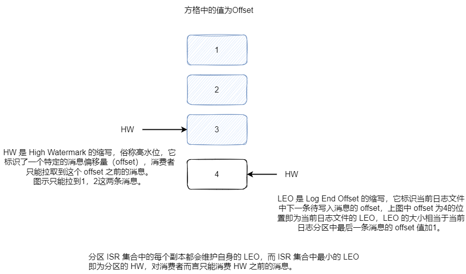
   
7. 消息写入后，HW和LEO变化图
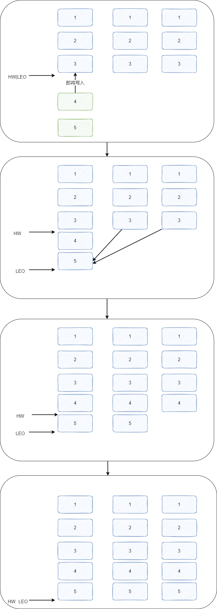
   
8. Kafka 的复制机制既不是完全的同步复制，也不是单纯的异步复制。事实上，同步复制要求所有能工作的 follower 副本都复制完，
   这条消息才会被确认为已成功提交，这种复制方式极大地影响了性能。而在异步复制方式下，follower 副本异步地从 leader 副本中复制数据，
   数据只要被 leader 副本写入就被认为已经成功提交。在这种情况下，如果 follower 副本都还没有复制完而落后于 leader 副本，
   突然 leader 副本宕机，则会造成数据丢失。Kafka 使用的这种 ISR 的方式则有效地权衡了数据可靠性和性能之间的关系。
