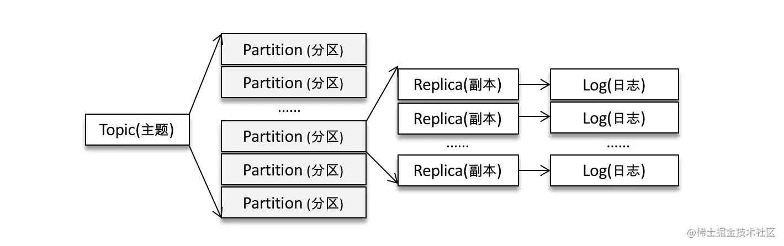

# [《图解 Kafka 之实战指南》](https://s.juejin.cn/ds/YsX42xu/)

## 1. 初识Kafka

`Kafka` 是用 `Scala` 语言开发的一个**多分区、多副本**且基于 `zookeeper` 协调的**分布式消息系统**。它可以作为**消息系统**、**存储系统**和**流式处理平台**。
典型的`Kafka`体系中包含三种角色，Broker作为服务节点，Producer 作为生产者发送消息，Consumer 作为消费者从 Broker 拉取消息进行消费

### 主题、分区和多副本机制


每个主题可以有多个分区，多个分区可以分布在不同的 Broker 上，而每个分区又引入了多副本机制，通过增加副本数量来提高容灾能力。
Leader副本负责处理读写请求，Follower副本只负责与Leader副本进行消息同步。图示中 Broker 节点数为4，某主题分区为3，副本因子也为3。

### 生产者客户端的整体架构


整个生产者客户端由两个线程协调运行，这两个线程分别为主线程和 Sender 线程（发送线程）。在主线程中由 KafkaProducer 创建消息，
然后通过可能的拦截器、序列化器和分区器的作用之后缓存到消息累加器（RecordAccumulator，也称为消息收集器）。

在消息累加器中，发往各个不同分区的消息以 `ProducerBatch` 批量消息的形式保存在双向队列中，Sender 线程负责从消息累加器中获取消息并将其发送到 Kafka。
因为消息在网络上都是以字节（Byte）的形式传输的，所以在线程中会对消息进行封装，封装成 `<Broker, Request>` 的形式，完成了应用层到I/O层的转换。

这些Request请求在从 Sender 线程发往 Kafka 之前还会保存到 `InFlightRequests` ，它的主要作用是缓存了已经发出去但还没有收到响应的请求，
能够通过参数配置最大的请求缓存数，以此来判断对应的 Broker 节点是否堆积了未响应的消息。

### 消费位移

消费位移的**自动提交是在 poll() 方法里完成的**，在每次真正向服务端发起拉取请求之前会检查是否可以进行位移提交(提交位移为当前消费消息的offset + 1)，它非常简便，
但是与此同时的是**重复消费**和**消息丢失**的问题。提交后的位移参数会在Kafka内部主题 `__consumer_offsets` 中记录，供之后拉取消息时判断，避免拉到重复的消息。

### 再均衡

**再均衡**是指分区的所属权从一个消费者转移到另一消费者的行为，它为消费组具备高可用性和伸缩性提供保障，
使我们可以既方便又安全地删除消费组内的消费者或往消费组内添加消费者。不过**在再均衡发生期间**，消费组内的消费者是无法读取消息的。

### 消费者拦截器

消费者拦截器对消息处理的时机：**poll()方法拉取消息返回之前**和**提交完消费位移之后**

### chapter_16_17_18 主题和分区


**主题**、**分区**、**副本和 Log（日志）**的关系如上图所示，**主题和分区都是提供给用户的抽象**，**实际物理上的存在是 Log**。
同一个分区中的多个副本必须分布在不同的 broker 中，这样才能提供**有效的数据冗余**。

Kafka**支持主题修改增加分区数**，但是此时需要注意有key值的消息，会在分区数增加后重新分区，比如开始在1分区的消息，
可能在根据key来计算分区号后而发往其他分区。但是**不支持减少分区数**。

### chapter_14 消费者的多线程实现

一般而言，**分区是消费线程的最小划分单位**。如果让多个线程同时消费同一个分区，打破了以分区为消费线程的最小划分单位，虽然这进一步提高了消费能力，
但是，这种方式对于消费位移的提交和顺序控制会变得很复杂，应用中用的比较少。

KafkaConsumer**不是线程安全的**，在执行公用方法的时候会调用`acquire方法`，这个方法它是一个轻量级锁，通过线程计数标记来检测是否发生了并发操作，
以此来保证只有一个线程在操作。

### chapter_13 消费者分区再均衡和消费者拦截器

**消费者拦截器**拦截的点位：**在poll方法返回消息之前**和**提交消费位移之后**，实例看`MyConsumerInterceptor`

## 参数配置

### Linux配置文件

在远程Linux上配置
```xml
listeners=PLAINTEXT://内网IP:9092

advertised.listeners=PLAINTEXT://外网IP:9092
```

- broker.id: 在集群情况下该值需要不同
- zookeeper.connect: 该参数指明 broker 要连接的 ZooKeeper 集群的服务地址（包含端口号），没有默认值，且此参数为必填项
- listeners: 该参数指明 broker 监听客户端连接的地址列表，即为客户端要连接 broker 的入口地址列表，
  protocol1://hostname1:port1,protocol2://hostname2:port2(协议://主机名:port，多个以逗号隔开)
- advertised.listeners: 公有云上的机器通常配备有多块网卡，即包含私网网卡和公网网卡，对于这种情况而言，
  可以设置 advertised.listeners 参数绑定公网IP供外部客户端使用，而配置 listeners 参数来绑定私网IP地址供 broker 间通信使用。
- broker.id: 指定 Kafka 集群中 broker 的唯一标识
- log.dir和log.dirs: Kafka 把所有的消息都保存在磁盘上，而这两个参数用来配置 Kafka 日志文件存放的根目录。一般情况下，log.dir 用来配置单个根目录，
  而 log.dirs 用来配置多个根目录（以逗号分隔），但是 Kafka 并没有对此做强制性限制，也就是说，log.dir 和 log.dirs 都可以用来配置单个或多个根目录。
  log.dirs 的优先级比 log.dir 高，但是如果没有配置 log.dirs，则会以 log.dir 配置为准。默认情况下只配置了 log.dir 参数，其默认值为 /tmp/kafka-logs。
- message.max.bytes: 该参数用来指定 broker 所能接收消息的最大值，默认值为1000012（B），约等于976.6KB。
  如果 Producer 发送的消息大于这个参数所设置的值，那么（Producer）就会报出 RecordTooLargeException 的异常。
  如果需要修改这个参数，那么还要考虑 max.request.size（客户端参数）、max.message.bytes（topic端参数）等参数的影响。
  为了避免修改此参数而引起级联的影响，建议在修改此参数之前考虑分拆消息的可行性。

### 生产者参数

1. **acks** 这个参数指定分区中必须要有多少个副本收到这条消息，生产者才认为这条消息是成功写入的。

**默认值为1**，即生产者发送消息后，只要分区leader副本成功写入消息，那么它就会收到来自服务器的成功响应。如果消息写入leader副本成功，但是在被follower
副本拉取之前leader崩溃，那么这条消息还是会丢失。它是消息可靠性和吞吐量之间的折中方案。

**当acks = 0时**，生产者发送消息之后不需要等待任何服务器的响应就认定发送成功。这是吞吐量最大的方案。

**当acks = -1或acks = all时**，生产者发送消息之后，需要等待ISR中所有副本写入才能收到来自服务器的成功响应。它是可靠性最高的方案，
但是也并不意味着消息就一定可靠，因为如果ISR中只有leader一个那么它其实和配置ack = 1的效果是一样的。

2. **max.request.size**: 这个参数用来限制生产者客户端能发送消息的最大值，默认为1048576B，即1MB。这个参数会涉及与 **message.max.bytes**
   参数的联动，如果将 message.max.bytes配置为10而max.request.size配置为20，这时候发送一条15b的消息，就会出现异常。

> org.apache.kafka.common.errors.RecordTooLargeException: The request included a message larger than the max message size the server will accept.

3. **max.in.flight.requests.per.connection**: 限制每个连接（也就是客户端与 Node 之间的连接）最多缓存的请求数，在需要保证消息顺序的场景下
   建议把这个参数配置为1，如果这个参数大于1且失败重试次数非零时，会出现错序的现象：第一批次写入失败，第二批次写入成功，第一批次重试写入成功后则会发生错序。

4. **retries和retry.backoff.ms**: 前者用来配置生产者发送消息失败后重试的次数，后者用来配置两次重试间的时间间隔，尽可能避免无效重试，也可以估算
   一下异常恢复的时间，合理配置时间间隔来避免生产者过早的放弃重试。像网络波动和leader副本选举发生时，通过重试是能将消息发送成功的。

5. **compression.type**: 这个参数用来指定消息的压缩方式，默认值为“none”，即默认情况下，消息不会被压缩。
   该参数还可以配置为“gzip”“snappy”和“lz4”。对消息进行压缩可以极大地减少网络传输量、降低网络I/O，从而提高整体的性能。
   消息压缩是一种使用时间换空间的优化方式，如果对时延有一定的要求，则不推荐对消息进行压缩。

6. **connections.max.idle.ms**: 这个参数用来指定在多久之后关闭闲置的连接，默认值是540000（ms），即9分钟。

7. **linger.ms**: 这个参数用来指定生产者发送 ProducerBatch 之前等待更多消息（ProducerRecord）加入 ProducerBatch 的时间，默认值为0。
   生产者客户端会在 ProducerBatch 被填满或等待时间超过 linger.ms 值时发送出去。增大这个参数的值会增加消息的延迟，但是同时能提升一定的吞吐量。

8. **receive.buffer.bytes**: 这个参数用来设置 Socket 接收消息缓冲区（SO_RECBUF）的大小，默认值为32768（B），即32KB。
   如果设置为-1，则使用操作系统的默认值。如果 Producer 与 Kafka 处于不同的机房，则可以适地调大这个参数值。

9. **send.buffer.bytes**: 这个参数用来设置 Socket 发送消息缓冲区（SO_SNDBUF）的大小，默认值为131072（B），即128KB。
   与 receive.buffer.bytes 参数一样，如果设置为-1，则使用操作系统的默认值。

10. **request.timeout.ms**: 这个参数用来配置 Producer 等待请求响应的最长时间，默认值为30000（ms）。请求超时之后可以选择进行重试。
    注意这个参数需要比 broker 端参数 replica.lag.time.max.ms 的值要大，这样可以减少因客户端重试而引起的消息重复的概率。

11. **enable.idempotence**: 是否开启幂等性功能

12. **buffer.memory**: 指 `RecordAccumulator` 用来缓存生产者发送消息的最大大小

13. **max.block.ms**: 如果生产者发送消息过快，当消息缓存大小超过 **buffer.memory** 的大小时，会进入阻塞状态，该参数表示阻塞的最长时间，超过该时间后抛出异常

14. **batch.size**: `RecordAccumulator` 中 `ProducerBatch` 的标准大小，当消息小于该大小时，以该大小创建；否则以实际消息大小创建

15. **max.in.flight.requests.per.connection**: 默认值为5，即在 `InFlightRequests` 中每个连接最多只能缓存5个未响应的请求

16. **metadata.max.age.ms**: 超过该配置的时间时则会对元数据进行更新，默认300000ms，5分钟。
    （原数据指Kafka集群的元数据，记录了集群中的哪些主题、主题有哪些分区，每个分区的Leader副本在哪个节点上，Follower副本在哪个节点上，哪些副本在AR、ISR等集合中）

### 消费者参数

1. **fetch.min.bytes**: 配置 Consumer 在调用`poll()方法`中能从 `broker` 中拉取的最小数据量，默认值为1（B）。
   `broker` 在收到 Consumer 的拉取请求时，如果返回给 Consumer 的数据量小于这个参数所配置的值，那么它就需要进行等待，
   直到数据量满足这个参数的配置大小。可以适当调大这个参数的值以提高一定的吞吐量，不过也会造成额外的延迟（latency），
   对于延迟敏感的应用可能就不可取了。

2. **fetch.max.bytes**: 用来配置 Consumer 在一次拉取请求中从Kafka中拉取的最大数据量，默认值为52428800（B），也就是50MB。
   如果这个参数设置的值比任何一条写入 Kafka 中的消息要小且它是第一个非空分区中拉取的第一条消息的话，它是不会被认为无法消费，这条消息仍然会正常返回。

3. **fetch.max.wait.ms**: 与**fetch.min.bytes**参数有关，为了满足拉取的数据量的最小值，但是也不能无限时长等待，默认500ms，
   超过这个时间之后，数据量不满足最小值也会响应

4. **max.partition.fetch.bytes**: 这个参数和**fetch.max.bytes**相似，它用来限制的是一次拉取每个分区的消息大小，
   同样为了保证Kafka的正常，也并不会严格限制大小造成无法消费的情况

5. **max.poll.records**: 配置 Consumer 在一次拉取请求中拉取的最大消息数，默认值为500（条）

6. **connections.max.idle.ms**: 用来指定在多久之后关闭闲置的连接，默认值是540000（ms），即9分钟

7. **exclude.internal.topics**: 指定内部主题（ `__consumer_offsets` 和 `__transaction_state`）的消费方式，
   默认为true，这种情况必须使用`subscribe(Collection)`的方式消费， 改成false时，内部主题就像变成了公开主题一样，怎么订阅都行了

8. **receive.buffer.bytes**: 配置Socket接收消息缓冲区大小，默认为65536（B），如果设置为-1，则为系统默认值

9. **request.timeout.ms**: 配置 Consumer 等待请求响应的最长时间，默认值为30000ms

10. **metadata.max.age.ms**: 配置元数据的过期时间，默认值为300000ms，过期后强制更新

11. **reconnect.backoff.ms**: 配置尝试重新连接指定主机之前的等待时间，避免频繁地连接主机，默认值为50ms

12. **retry.backoff.ms**: 配置尝试重新发送失败的请求到指定的主题分区之前的等待，默认100ms

13. **isolation.level**: 配置消费者的事务隔离级别，`read_committed`消费者就会忽略事务未提交的消息，即只能消费到LSO，
    默认情况下为`read_uncommitted`，即可以消费到HW处的位置

14. **group.id**: 消费组名称，一般这个名称有业务意义

15. **client.id**: 用来设定消费者的ID名称

16. **enable.auto.commit**: 消费者位移是否自动提交，默认为 true

17. **auto.commit.interval.ms**: 消费者位移自动提交的周期，默认5000ms

18. **auto.offset.reset**: 消费者找不到消费位移时，默认为 `latest`，从分区末尾开始消费；`earliest` 从分区开始进行消费；`none` 则会抛出异常

## 操作命令

创建分区为3副本因子为3的主题
```
bin/kafka-topics.sh --zookeeper localhost:2181 --create --topic fang-yuan --replication-factor 3 --partitions 3
```

展示主题的更多具体信息
```
bin/kafka-topics.sh --zookeeper localhost:2181 --describe --topic topic-demo
```

通过 kafka-console-consumer.sh 脚本来订阅主题 topic-demo 其中--bootstrap-server 指定了连接的 Kafka 集群地址
```
bin/kafka-console-consumer.sh --bootstrap-server 10.0.24.15:9092 --topic topic-demo
```

使用 kafka-console-producer.sh 脚本发送一条消息“Hello, Kafka!”至主题 topic-demo
```
bin/kafka-console-producer.sh --broker-list 10.0.24.15:9092 --topic topic-demo
> hello Kafka!
```

## 问题整理

#### Kafka 的用途有哪些？使用场景如何？

`Kafka` 是用 `Scala` 语言开发的一个**多分区、多副本**且基于 `zookeeper` 协调的**分布式消息系统**。它可以作为**消息系统**、**存储系统**和**流式处理平台**。
消息系统用来实现解耦、流量削峰、异步通信等；存储可用于数据的持久化；流式处理可以为一些开源的流式处理框架提供数据源。

#### Kafka 中的 ISR、AR 又代表什么？ISR 的伸缩又指什么

AR(Assigned Replicas) 是Kafka分区中所有的副本，ISR(In-Sync Replicas) 是所有与 `leader` 副本**保持一定程度同步**的副本，

！！ 什么参数控制着这个一定程度的要求呢 ！！

还有一个OSR(Out-of-Sync Replicas)是与 `leader` 副本滞后过多的副本。它们的滞后状态由 leader 副本进行维护，当 follower 副本落后太多时，
会被 leader 副本从ISR集合中剔除，反之，赶上来的副本会从OSR集合中加入到ISR集合中。

！！ ISR 的伸缩又指什么 ！！


#### Kafka 中的 HW、LEO、LSO、LW 等分别代表什么？

LEO(Log End Offset) 它表示的是**当前分区日志中下一条待写入消息**的 `offset`；HW(High Watermark)高水位，它表示的是消费者只能拉取到这个 `offset`
**之前的**消息，它是**该主题下所有ISR分区日志文件**中最小的LEO。

LSO、LW

Kafka 借助 ISR 实现主从复制: 当其中副本有复制完成消息时更新HW来控制消费者能消费的消息，
有效地权衡了**数据可靠性**和**性能**之间的关系，如果是完全同步复制的话，性能太差；如果是异步复制的话，数据可靠性又比较难保证；

#### Kafka 中是怎么体现消息顺序性的？


#### Kafka 中的拦截器、序列化器、分区器是否了解？它们之间的处理顺序是什么？

拦截器、分区器、序列化器都是生产者在向 Broker 节点发送消息之前对消息进行处理的，拦截器可以用来在消息发送前做一些业务准备工作；
序列化器是将消息对象转换成字节数组；而分区器则是确定这个消息发送到该主题的具体分区。

它们的处理顺序是：拦截器、序列化器、分区器。

#### Kafka 生产者客户端的整体结构是什么样子的？


#### Kafka 生产者客户端中使用了几个线程来处理？分别是什么？

使用了两个线程来进行处理，分别是主线程和Sender线程。在主线程中由 `KafkaProducer` 创建消息，然后通过可能存在的拦截器、序列化器和分区器的作用之后，
缓存到消息累加器中；而Sender线程负责从消息累加器获取消息并将其发送到Kafka中。

#### 简述消费者与消费组之间的关系


消费组是逻辑上的概念，每个消费组可以包含多个消费者，每个消费者只能隶属于一个消费组。因此 `Kafka` 能够支持基于队列的**点对点模式**和**发布订阅模式**，
点对点是对同一个消费组而言，消息会被均衡的投递给每一个消费者，即每条消息只会被一个消费者处理；
发布订阅模式则对于多个消费组，每条消息都会被不同消费组的不同消费者消费。


#### “消费组中的消费者个数如果超过 topic 的分区，那么就会有消费者消费不到数据”这句话是否正确？如果正确，那么有没有什么避免的手段？

是正确的，在同一个消费组中，如果消费者数量大于分区数量，那么就会出现消费者闲置。可以通过将该闲置消费者加入新的消费组订阅这个主题进行消费。

#### 消费者提交消费位移时提交的是当前消费到的最新消息的 offset 还是 offset+1?

是 `offset + 1`

#### 有哪些情形会造成重复消费？

在自动提交消费位移的情况下，如果拉取到一批消息开始消费后，在下一次消费位移提交前，出现消费者宕机的情况就会造成重复消费

#### 那些情景下会造成消息漏消费？

如果消息的消费不是拉取到就及时消费的话，比如某消费者使用线程A拉取消息并提交消费位移，线程B来对消息进行消费，但是在消息没消费完之前B线程因异常被终止，
那么这就会出现消息丢失的问题

#### KafkaConsumer 是非线程安全的，那么怎么样实现多线程消费？


#### 当你使用 kafka-topics.sh 创建（删除）了一个 topic 之后，Kafka 背后会执行什么逻辑？


#### topic 的分区数可不可以增加？如果可以怎么增加？如果不可以，那又是为什么？


#### topic 的分区数可不可以减少？如果可以怎么减少？如果不可以，那又是为什么？


#### 创建 topic 时如何选择合适的分区数？


#### Kafka 目前有哪些内部 topic，它们都有什么特征？各自的作用又是什么？


#### 优先副本是什么？它有什么特殊的作用？


#### Kafka 有哪几处地方有分区分配的概念？简述大致的过程及原理


#### 简述 Kafka 的日志目录结构


#### Kafka 中有那些索引文件？


#### 如果我指定了一个 offset，Kafka 怎么查找到对应的消息？


#### 如果我指定了一个 timestamp，Kafka 怎么查找到对应的消息？


#### 聊一聊你对 Kafka 的 Log Retention 的理解


#### 聊一聊你对 Kafka 的 Log Compaction 的理解


#### 聊一聊你对 Kafka 底层存储的理解（页缓存、内核层、块层、设备层）


#### 聊一聊 Kafka 的延时操作的原理


#### 聊一聊 Kafka 控制器的作用


#### 消费再均衡的原理是什么？（提示：消费者协调器和消费组协调器）


#### Kafka 中的幂等是怎么实现的？


#### Kafka 中的事务是怎么实现的？


#### Kafka 中有那些地方需要选举？这些地方的选举策略又有哪些？


#### 失效副本是指什么？有那些应对措施？


#### 多副本下，各个副本中的 HW 和 LEO 的演变过程


#### 为什么 Kafka 不支持读写分离？


#### Kafka 在可靠性方面做了哪些改进？（HW, LeaderEpoch）


#### Kafka 中怎么实现死信队列和重试队列？


#### Kafka 中的延迟队列怎么实现


#### Kafka 中怎么做消息审计？


#### Kafka 中怎么做消息轨迹？


#### Kafka 中有那些配置参数比较有意思？聊一聊你的看法


#### Kafka 中有那些命名比较有意思？聊一聊你的看法


#### Kafka 有哪些指标需要着重关注？


#### 怎么计算 Lag？(注意read_uncommitted和read_committed状态下的不同)


#### Kafka 的那些设计让它有如此高的性能？


#### Kafka 有什么优缺点？


#### 还用过什么同质类的其它产品，与 Kafka 相比有什么优缺点？


#### 为什么选择 Kafka ?


#### 在使用 Kafka 的过程中遇到过什么困难？怎么解决的？


#### 怎么样才能确保 Kafka 极大程度上的可靠性？


#### 聊一聊你对 Kafka 生态的理解


